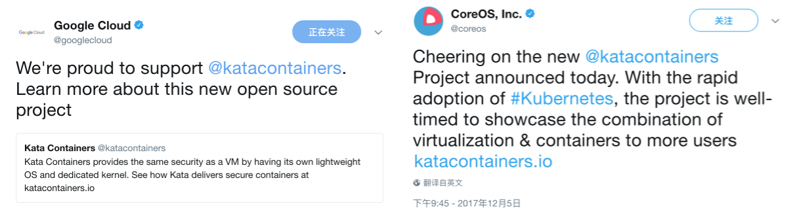

title: "Kata Containers 背后的故事"
date: 2017-12-05 04:05:08 -0600
update:
author: me
cover:
categories:
    - hyper
tags:
    - kata
    - kata_containers
    - runv
    - intel
    - openstack_foundation
preview: "昨天，我们（Hyper, Intel, 和 OpenStack Foundation）官方宣布了 kata containers 项目，这个致力于开发和推进虚拟化容器这一 IT 基础设施技术的项目。原有 Hyper runV 和 Intel Containers 的开发成果和开发力量将共同并入新的 Kata Containers 项目"
draft: true

---

因为早上5点去机场接回了同事张磊，而后面 8点还要和 CNCF 基金会的朋友一起喝早咖啡，我和张磊早上六七点钟的时候，正是对着计算机唠嗑的时候。此刻，忽然 slack 里 `pre-launch-general` channel 忽然冒出了一条消息——

> jbryce [7:04 AM]
> It's live!!
> https://twitter.com/TechCrunch/status/938030281361117186
> Nice lead off article from Frederic

OpenStack Foundation Executive Director Jonathan 通知大家，已经 Announce 了！我不由得虎躯一震啊

> 真 *** 的早

当我把我转推的推文第一时间截图发到朋友圈的时候，正是国内朋友们在床边刷朋友圈是时候，只有区区七百多微信好友的我，这张截图也在不到一天里收获了一百个赞。晚上，当我和 Jonathan 说 "It's crazy early" 的时候，他也说，作为一个全球的项目，不得不照顾同时照顾欧洲、亚洲、美洲的时间，所以这样的时间对他来说算是家常便饭了。

嗯，就这样。而官方的新闻稿是这么说的

> Intel and Hyper partner with the OpenStack Foundation to launch the Kata Containers project http://tcrn.ch/2jScKIQ  by @fredericl

随后，在一天之内，收到了很多公司和机构的推荐，比如这两家

顺便说，这两家公司都是列在 Kata 项目初始成员列表里的，Google Cloud 说得很清晰

> We're proud to support @katacontainers.

嗯，就这样。晚上， Jonathan 邀请大家来他家一起聚会庆祝一下，我在朋友圈里发了在德州的初始成员的合影，尊重肖像权就不在这里再发了，我在朋友圈评论里也说了——

> 说明下哈，这组合影里，第一张是 OpenStack foundation 的 executive director Jonathan，其余都是和 clear container的初始成员；中间一张我抢的位置，是为没有到现场，但做了大量贡献的 hyper 团队成员抢的，你们值得这个位置，咱们年底普吉 kata 海滩团建见哈。

嗯，这段话极尽我对团队成员拍马屁之能，但我说你们值这个位置

一个半月之前，我和彭涛、James 就来过一次奥斯汀，转成跑来和 Intel 以及 Foundation 一起讨论，从具体项目如何合并、接口模块怎么定，到初始如何邀请公司加入，怎么指定技术和管理委员会成员等等。具体到技术这方面，Hyper 团队的每位成员都相当的积极主动，尤其是在场的彭涛同学

