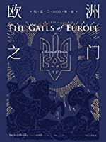

title: "《欧洲之门》读后感"
date: 2022-10-26 13:42:08 +0800
update:
author: me
cover: assets/ukraine.jpg
categories:
    - readings
tags:
    - history
    - ukraine
preview: "在乌克兰危机中，历史不止一次成为借口，也不止一次遭到滥用。它不仅被用来对危机参与者进行宣传和鼓动，也被用来为对国际法、人权乃至生命权本身对侵犯行为辩护。"
draft: false

---

在我的每天半小时读书计划里看完了这本《欧洲之门：乌克兰2000年史》 ，在总结之前，作者这句话是我的心声，要被声明出来——

> 在乌克兰危机中，历史不止一次成为借口，也不止一次遭到滥用。它不仅被用来对危机参与者进行宣传和鼓动，也被用来为对国际法、人权乃至生命权本身对侵犯行为辩护。

历史不应成为践踏国际法的借口，历史是有各种变迁的，人类之间的事情，也很少有非黑即白的，我们研究历史是为了更好地读懂今天，而不是侵犯他人的权利、践踏他人的尊严。总结下大致关键点——

1. 维京罗斯人建立了基辅罗斯，皈依了拜占庭正教会；
2. 后来罗斯人不断演化的分支大体包括现在的俄罗斯、白俄罗斯和乌克兰；
3. 哥萨克被现代乌克兰民族认同为自己的起源大概有至少两百年了，但哥萨克国其实一直是半独立状态，或多或少的自治；
4. 现代乌克兰、白俄罗斯长期处于波兰-立陶宛联邦统治之下，波兰统治的部分大概是现在的乌克兰，立陶宛统治的部分大概是现在的白俄罗斯；
5. 历史上哥萨克曾经和沙皇签定合约，1654年哥萨克同意效忠沙皇换取沙皇的保护，这就是俄罗斯所说的乌克兰“重回”俄罗斯；
6. 乌克兰在寻求独立的过程中，和波兰同样有过民族冲突；
7. 乌克兰曾经是帝国争夺的一个边缘地带，而克里米亚，历史上是地中海-黑海文明的一部分，在哥萨克时期，它其实属于奥斯曼帝国统治下的鞑靼人，它确实不曾属于哥萨克国，但其实原住民也不是俄罗斯人；
8. 近代沙俄的工业化进程中，乌克兰本地人因为土地占用更多一些，多数继续务农，而工业人口很多都来自俄罗斯；
9. 亨廷顿说的宗教分裂其实很不严谨，乌克兰天主教徒，大部分是教会联合的产物，所谓希腊礼天主教徒，乌克兰目前的教会目前大概有四种分支，没有哪个是绝对领先的，但不代表其中哪个是希望加入俄国的。

最后，我想说，民族不是一个逐渐分化的树状结构，甚至很多民族都不是“单系群”，民族是在人们的迁徙、繁衍的历史进程中，逐渐形成的文化认同，传说都可以是重塑的，通过时间的积累和文化的交流确认，民族逐渐建立起来，这中间存在很多模糊地带，在乌克兰土地上，尤其城市里，说俄语可能是方便交流，不代表认同自己是俄罗斯人。

